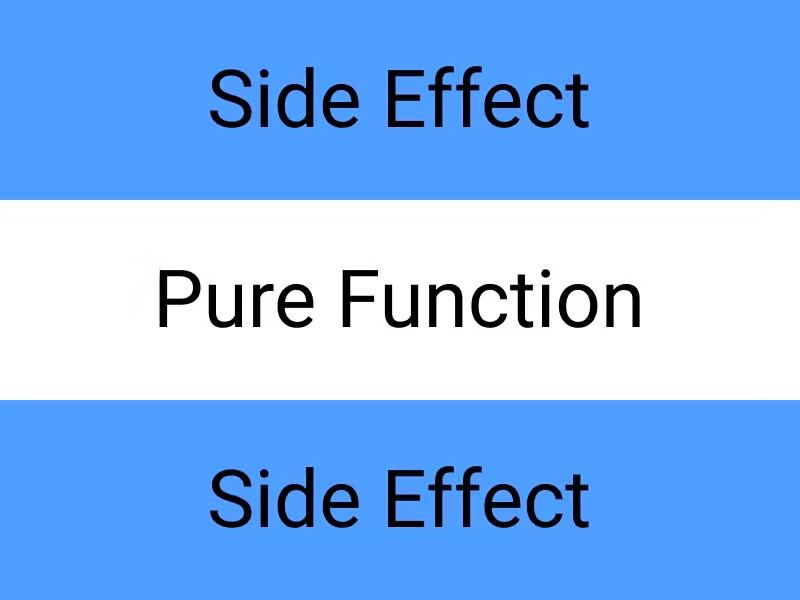

# React clean architecture

*Попытка в хоть какой-то структурированный react-проект.*

Небольшое предисловие.

Для кого эта статья? - Для тех, кто начал задумываться, как лучше отделить логику от **ui**, чтобы проект можно было легче расширять и менее болезнено поддерживать.

Все, что будет дальше вдохновлено вот этой [статьей](https://bespoyasov.ru/blog/clean-architecture-on-frontend/).

Любые совпадения со статьей выше не случайны. Настоятельно рекомендую ознакомиться с ней для более полного понимания темы.

Основная идея - это сделать выжимку из статьи выше и предложить конкретную реализацию чистой архитектуры на React.

Реализация архитектуры будет не совсем чистой в ее исходном понимании, т.к. в ней мы будем завязываться на хуки, что вынуждает нас использовать React, а также некоторые вещи будут вырезаны, но в замен это дает заметное упрощение при написании кода и избавлении нас от некоторого количества оберток.

Итак, приступим.

## Чистая архитектура

**Предметная область** - часть реального мира, которую мы моделируем программой.

**Чистая архитектура** — это способ разделения ответственностей и частей функциональности по степени их близости к предметной области приложения.

Чистую архитектуру часто называют трёхслойной, потому что приложение в ней делится на 3 главных слоя.


Диаграмма слоёв по чистой архитектуре: в центре домен, вокруг него прикладной слой, и снаружи — слой адаптеров.

### Доменный слой

Представляет собой те сущности и данные, которые описывают предметную область приложения, а также код для преобразования этих данных.

**Домен** — это ядро, которое отличает одно приложение от другого.

Структура данных доменных сущностей и суть их преобразований не зависит от внешних обстоятельств. Внешние обстоятельства запускают доменные преобразования, но **не определяют**, как они будут протекать.

**Пример**

Сущность "корзина" содержит в себе какое-то представление корзины из реального мира.

```ts
type Product = {
  name: string;
  price: number;
};

type Cart = {
  products: Product[],
};
```

Преобразование сущности "корзина" - добавить товар в корзину.

```ts
function addProductToCart(cart: Cart, product: Product): Cart {
  return {
    ...cart,
    products: [
      ...cart.products,
      product,
    ],
  };
}
```

### Прикладной слой

Представляет собой пользовательские сценарии - **юзкейсы**.

Они отвечают за то, что происходит после возникновения какого-то события.

**Пример**

Cценарий "Добавить товар в корзину" описывает действия, которые должны произойти после нажатия на кнопку.

Это такой алгоритм, который говорит:

1. возьми текущую корзину;
2. выполни доменное преобразование `addProductToCart`;
3. верни измененную корзину.

Также в прикладном слое находятся **порты** — спецификации того, как наше приложение хочет, чтобы с ним общался внешний мир. Обычно **порт** — это интерфейс, контракт на поведение.

Порты служат «буфером» между хотелками нашего приложения и реалиями внешнего мира.

**Входные порты** (Input Ports) говорят, как приложение хочет, чтобы к нему обращались извне.

**Выходные порты** (Output Ports) говорят, как приложение собирается общаться с внешним миром, чтобы тот был готов к этому.

**Пример**

Наше приложение оповещает пользователя о каком-то событии.

Нам не важно, что используется в качестве сервиса нотификации, т.к. он может изменится в ходе разработки.
Поэтому мы объявляем то, как наше приложение обращается к нему и используем этот сервис в коде.

```tsx
type NotificationServicePort = {
  notify: (message: string): void;
};
```

Если что-то изменится в будущем, то нужно будет только имплементировать наш порт и использование в коде останется преждним.

### Слой адаптеров

Представляет собой сервисы превращающие несовместимый API внешнего мира в API, который ожидает наше приложение.

Адаптеры часто делят на:

- **управляющие** (driving) — которые посылают сигналы нашему приложению;
- **управляемые** (driven) — которые получают сигналы от нашего приложения.

Управляющие адаптеры - обработка нажатия кнопки UI-фреймворком.

Управляемые адаптеры - отправка запроса на сервер.

Здесь появляется первое отличие от канонической архитектуры представленной в статье выше.

> На самом внешнем слое находятся адаптеры к внешним сервисам. Адаптеры нужны, чтобы превращать несовместимое API внешних сервисов в совместимое с хотелками нашего приложения.
Адаптеры — это отличный способ понизить зацепление между нашим кодом и кодом сторонних сервисов. Низкое зацепление уменьшает необходимость менять один модуль при изменении других.

В статье хуки, как и **ui** в целом, выделяются в слой адаптеров, что правильно с точки зрения зацепления приложения, но т.к. мы изначально проектируем архитектуру с расчетом использования React, то этот момент можно упростить.

В части [Application](#application) этот момент будет подробно разобран.

Вернемся непосредственно к слою адаптеров.

В него мы будем выделять сервисы, которые будут общаться с внешним API, например:
1. Браузерное хранилище (localStorage, sessionStorage);
2. Запросы к серверу (fetch);
3. Хранилище (redux, recoil).

**Пример**

```tsx
export type SessionBrowserStorageServicePort = {
  getSession: () => Session | null;
  setSession: (session: Session) => void;
  clearSession: () => void;
};
```

```tsx
const SESSION_KEY = 'session';

export class SessionLocalStorageService extends BaseLocalStorageService implements SessionBrowserStorageServicePort {
  getSession() {
    return this.getItem<Session>(SESSION_KEY);
  }

  setSession(session: Session) {
    this.setItem(SESSION_KEY, session);
  }

  clearSession() {
    this.removeItem(SESSION_KEY);
  }
}
```

В этом примере нас интересует `SessionBrowserStorageServicePort`.

Это порт, который показывает, как наше приложение хочет использовать сервис браузерного сессионого хранилища.

То есть, сервис может использовать любые внешние API, главное, чтобы он имплементировал тот интерфейс, который от него ожидает приложение.

### Правило зависимостей

У трёхслойной архитектуры есть правило зависимостей: только внешние слои могут зависеть от внутренних. Это значит, что:

- домен должен быть независим;
- прикладной слой может зависеть от домена;
- внешние слои могут зависеть от чего угодно.

**Внешние слои могут зависеть от внутренних, но не наоборот.**

### Плюсы и минусы чистой архитектуры

Сперва стоит уточнить, что чистая архитектура - не панацея. Это инструмент, а инструменты нужно использовать там, где они нужны.

Плюсы и минусы достаточно субъективны, потому что мир разработки далеко не бинарный, поэтому в разных ситуация плюсы или минусы не такие однозначные.

#### Плюсы

Общий плюс для всех слоев - это **обособленность** разных частей приложения.

Главные части - **бизнес логика**, **пользовательские сценарии**, **сервисы**, **UI** разделены.

Это позволяет легко покрывать разные части приложения тестами. Новому разработчику легче понять, что происходит в проекте.

**Обособленный домен**
Обособленный домен проще проверять на соответствие ожиданиям бизнеса, а также это помогает быстрее искать ошибки и неточности «перевода» с языка бизнеса на язык программирования.

**Независимые юзкейсы**
Логика приложения выделяется от остального кода, что упрощает восприятие, как юзекейсов, так и UI'a. Юзкейсы диктуют в каком виде ему нужны сервисы, поэтому порты обеспечивают гарант того, что если мы поменяем библиотеку, используемую в каком-то сервисе, то в остальной части приложения ничего изменять не нужно.

Если вы, по каким-то причинам, не хотите покрывать юзкейсы тестами, то далее будет разобрано еще одно упрощение, которое поможет сэкономить время на разработку.

**Заменяемые сторонние сервисы**
Внешние сервисы становятся заменяемыми благодаря портам. Пока мы не меняем интерфейс взаимодействия с приложением, нам не важно, какой именно внешний сервис будет реализовывать этот интерфейс.

Таким образом мы создаём барьер для распространения изменений: изменения в чужом коде не влияют напрямую на наш. Порты также ограничивают и распространение ошибок во время работы приложения.

#### Минусы

**Повышенное время разработки**
Повышается время не только на написание кода, но и на проектирование. Вместо быстрого написания бизнес логики прямо в компоненте нужно подумать, как лучше ее декомпозировать.

**Повышенный порог входа**
Хоть и достаточно прозначная структура слоев дает улучшение в читаемости и поддерживаемости, но и повышает порог входа разработчикам, которые раньше либо не сталкивались, либо не задумывались о декомпозировании кода, который они обычно пишут.

**Увеличивает количество кода**
Конкретно фронтендовая проблема в том, что чистая архитектура может увеличить количество кода в финальном бандле. Чем больше кода мы отдадим браузеру, тем больше ему скачивать, парсить и интерпретировать.

За количеством кода придётся следить и принимать решения о том, где срезать углы:
- может, чуть проще описать юзкейс;
- может, придётся настраивать код-сплиттинг и т. д.

#### Борьба с минусами

**Повышенный порог входа**
Эта статья служит вводным руководством по чистой архитектуре на React. Поэтому, надеюсь, она поможет новым разработчикам упросить порог входа в проект.

Опять же, чистая архитектура достаточно гибкая, поэтому если вы используете ее не в том виде, в котором она изложена в статье, то просто форкните статью к себе и поправьте под свои нужны.

**Повышенное время разработки**
Для того, чтобы поддерживать читаемость кода в проекте, он должен быть однотипным. Дальше будут конкретные примеры, которые помогут оставить код однотипным и ускорят написание отдельных слоев приложения.

*BTW: в будущем планируется создание расширения для VSCode, которое избавит от самостоятельного написания бойлерплетов для разных слоев приложения*

## Реализация архитектуры

Для начала несколько маленьких советов.

Выносите каждую отдельную функцию, тип или сущность в отдельный файл. Может показаться громозким, но, субъективно, читаемость кода повышается.

Для описания типов/сущностей, хотя бы доменного слоя, используйте [type-alias](https://www.typescriptlang.org/docs/handbook/2/everyday-types.html#type-aliases). Более прозрачные типы помогают легче ориентироваться в проекте.

Если коротко, то их суть сводится к человекочитаемому и более точному определению типов.

Если такие типы используются во многих частях приложения, то справедливо будет вынести их в отдельный файл, доступный глобально ```shared-kernal.d.ts```, ```global.d.ts```.

**Пример**

```tsx
// shared-kernal.d.ts
type Email = string;
type Password = string;
type Token = string;
type UniqNumericId = number;
```

Перейдем непосредственно к проектированию.

Ниже после разбора каждого слоя будет представлена абстрактная структура проекта.

Верхнеуровненые папки будут выступать в роли слоев приложения.

Для начала выделим основные слои:

- **domain** - доменный слой
- **application** - прикладной слой
- **service** - слой адаптеров

Хоть по канону представление относится к слою адаптеров, но т.к. мы изначально завязываемся на React, то выделим его в отдельный слой - **ui**.

Так же выделим отдельный слой для библиотечного кода, который можно использовать по всему проекту - **lib**.

Итого **базовая структура проекта**:

```bash
...
src
  ├── application
  ├── domains
  ├── lib
  ├── services
  └── ui
...
```

Теперь сформируем критерии, которым наша реализация должна соотвествовать:

1. обособленность слоев;
2. легкость тестирования;
3. реактивность.

##### Обособленность слоев
С обособленностью в глобальном смысле разобрались выше. Каждый отдельный слой подробно будет описан ниже.

##### Легкость тестирования
Легкость тестирования бизнес логики достигается декомпозицией и независимостью **domain**-слоя, что будет описано ниже.
А легкость тестирования будет рассмотрена в описании **application**-слоя.

##### Реактивность
Завязка на React не была просто облегчением некоторых вещей в канонической архитектуре. React hooks дают нам реактивность из коробки. Детальнее это будет разобрано в описании **application** слоя.

Теперь перейдем к описанию каждого слоя.

### Domain

В доменном слое хранится бизнес логика приложения. Все преобразования данных должны быть чистыми функциями.

Разобьем бизнес логику на главные части:

1. Структура данных - **entities**
2. Изменение данных - **mutations**
3. Получение преобразованных данных - **queries**

Все эти части будут сгрупированны одной конкретной сущностью, которая описывает какую-то часть бизнес логики.

#### Entities
*Это интерфейсы, которые описывают конкретную сущность бизнес логики.*

**Пример**

```ts
// shared-kernel.d.ts
type PriceRub = number;

// domain/product/entities/Product.ts
type Product = {
  name: string;
  price: PriceRub;
};

// domain/cart/entities/Cart.ts
type Cart = {
  products: Product[],
};
```

#### Mutations
*Это функции для изменения **Entities**. (set)*

Приписку **Mutation** используется в названии функции, чтобы избежать коллизий имен при использовании в юзкейсах.

**Пример**

```ts
// domain/cart/mutations/addProductToCart.ts
function addProductToCartMutation(cart: Cart, product: Product): Cart {
  return {
    ...cart,
    products: [
      ...cart.products,
      product,
    ],
  };
}
```

#### Queries
*Это функции, которые возвращают преобразованные данные на основе **Entities** (get)*

Приписку **Query** используется в названии функции, чтобы избежать коллизий имен при использовании в юзкейсах.

**Пример**
```ts
// domain/cart/queries/getTotalCartAmount.ts
function getTotalCartAmountQuery(cart: Cart): Cart {
  return cart.products.reduce((total, { price }) => total + price, 0);
}
```

Итого структура проекта:
```bash
...
src
  ├── application
  ├── domain
  │   └── entity
  │       ├── entities
  │       ├── mutations
  │       └── queries
  ├── lib
  ├── service
  └── ui
...
```

Под **entity** в структуре проекта понимается конкретная сущность бизнес логики, из примера выше - это **cart**.

### Application

<a name="Realization-application"></a>

В прикладном слое хранятся юзкейсы. Юзкейсы предполагают взаимодействие с внешним миром, а значит — использование внешних сервисов. Взаимодействие со внешним миром — это сайд-эффекты.

Основная идея юзкейса заключается в том, чтобы:

1. получить данные (сайд-эффект);
2. сделать чистое преобразование данных;
3. сделать что-то с преобразованными данными (сайд-эффект).


Функциональная архитектура: сайд-эффект, чистая функция, сайд-эффект

Помимо юзкейсов в прикладном слое хранятся порты, которые сервисы должны имплементировать. То есть именно юзкейсы определяют то, в каком виде сервис получает от них данные на вход и отдает данные на выход.

Хранить все порты мы будем в папке ```src/application/__ports__```.

**Пример**

```tsx
// application/__ports__/storeServices/CartStoreServicePort.ts
export type CartStoreServicePort = {
  getCart: () => Cart;
  setCart: (cart: Cart) => void;
};

// application/__ports__/apiServices/CartApiServicePort.ts
export type CartApiServicePort = {
  addProduct: (product: Product) => Promise<Cart>;
};
```

Воспользуемся описанными выше портами ```CartStoreServicePort```, ```CartApiServicePort```.

Рассмотрим юзкейс добавления продукта в корзину:

```tsx
// application/cart/addProductToCart.ts
type AddProductToCartParams = {
  payload: {
    product: Product;
  };
  deps: {
    cartStoreService: CartStoreServicePort;
    cartApiService: CartApiServicePort;
  };
};

export const addProductToCart = async ({
  payload,
  deps,
}: AddProductToCartParams) => {
  const { cartStoreService, cartApiService } = deps;
  const { product } = payload;

  try {
    await cartApiService.addProduct(product);
    const cart = cartStoreService.getCart();

    const updatedCart = addProductToCartMutation(cart, product);

    cartStoreService.setCart(updatedCart);
  } catch (e) {
    return e;
  }
};
```

Теперь разберем, что из себя представляет юзкейс.

Юзкейс - это функция, которая принимает на вход объект из 2 параметров:

1. **payload** - это какие-то данные, которые прокидываются из нашего приложения (может быть любой структурой данных);
2. **deps** - это зависимости (сервисы), которые используются для выполнения юзкейса.

> Почему не прокидывать данные и зависимости в одном объекта без разделения?
Субъективно, но это улучшает читаемость юзкейса.

В примере ```cartApiService.addProductToCart(product)``` возвращает корзину, но для наглядности чистого преобразования она не используется.

> Перед тем, как двигаться дальше отмечу, что юзкейс в текущем виде использовать в **ui**-слое неудобно, т.к. в него нужно прокидывать зависимости. Держите это в голове, чуть позже это будет разобрано подробнее.

Теперь рассмотрим как можно улучшить и одновременно стандартизировать этот юзкейс.

На **ui**-слое мы должны знать, в каком состоянии сейчас выполнение юзкейса, а также об ошибке, которая могла возникнуть в результате его выполнения.

Для стандартизации юзкейсов создадим собственный порт ```UseCasePort```, который будут имплементировать все наши адаптеры юзкейсов. Имплементацию этого порта разберем немного позже.

Для начала выделим сущности, которые будем возвращать из юзкейса.

```tsx
// domain/status/entities/Status.ts
export type Status = 'IDLE' | 'PENDING' | 'SUCCESS' | 'ERROR';

// domain/error/entities/Error.ts
export type Error = {
  messages?: string[];
  code: number;
};
```

Теперь опишем сам ```UseCasePort```:

```tsx
// application/__ports__/useCases/UseCasePort.ts
export type UseCasePort<T extends (...args: any[]) => any> = {
  status: Status;
  error: Error | null;
  execute: T;
};
```

Разберем каждый параметр:

```Status``` - то, в каком состоянии сейчас находится выполнение юзкейса.

```Error``` - ошибка, которая произошла в результате выполнения юзкейса.

В **ui**-слое будет удобно отображать какие-то компоненты, в зависимости от этих параметров.

Мы выделили их в **domain**-слой, потому что ошибки и состояние юзкейса - это сущность приложения, которая опосредованно является бизнес логикой.

```Execute``` - это непосредствено пользовательский сценарий.

Для более стандартизированного использования нам понадобится сервис, который инкапсулирует логику состояния юзкейса, но пока нам нужен только его порт.

```tsx
// appication/__ports__/statuses/StatusServicePort.ts
export type StatusServicePort = {
  status: Status;
  setStatus: (status: Status) => void;
  error: Error | null;
  setError: (error: Error | null) => void;
  setState: (status: Status, error: Error | null) => void;
};
```

Теперь переделаем юзкейс с добавлением ```StatusServicePort```:

```tsx
// application/cart/addProductToCart.ts
type AddProductToCartParams = {
  payload: {
    product: Product;
  };
  deps: {
    cartStoreService: CartStoreServicePort;
    cartApiService: CartApiServicePort;
    statusService: StatusServicePort;
  };
};

export const addProductToCart = async ({
  payload,
  deps,
}: AddProductToCartParams) => {
  const { cartStoreService, cartApiService, statusService } = deps;
  const { product } = payload;

  try {
    statusService.setState('PENDING', null);

    await cartApiService.addProduct(product);
    const cart = cartStoreService.getCart();

    const updatedCart = addProductToCartMutation(cart, product);

    cartStoreService.setCart(updatedCart);

    statusService.setState('SUCCESS', null);
  } catch (e) {
    statusService.setState('ERROR', e as Error);
  }
};
```

Так выглядит юзкейс в каноничной архитектуре.

Этому юзкейсу нужен адапатер, который в себе инкапсулирует инстансы сервисов, чтобы прокинуть прокинуть их в сам юзкейс.

По канону нужно отделить адаптер от юзкейса, но т.к. мы завязаны на React, то для упрощения разработки мы не будет отделять адаптеры юзкейсов от самих юзкейсов.

Мы просто опишем сам адаптер в том же файле.

Готовый юзкейс выглядит следующим образом:

```tsx
// application/cart/addProductToCart.ts
...
// импортируем cartApiService, т.к. api-сервисы зачастую являются синглтонами.
import { cartApiService } from 'service';
...

type AddProductToCartParams = {
  payload: {
    product: Product;
  };
  deps: {
    cartStoreService: CartStoreServicePort;
    cartApiService: CartApiServicePort;
    statusService: StatusServicePort;
  };
};

// юзкейс
export const addProductToCart = async ({
  payload,
  deps,
}: AddProductToCartParams) => {
  const { cartStoreService, cartApiService, statusService } = deps;
  const { product } = payload;

  try {
    statusService.setState('PENDING', null);

    await cartApiService.addProduct(product);
    const cart = cartStoreService.getCart();

    const updatedCart = addProductToCartMutation(cart, product);

    cartStoreService.setCart(updatedCart);

    statusService.setState('SUCCESS', null);
  } catch (e) {
    statusService.setState('ERROR', e as Error);
  }
};

// адаптер юзкейса
export const useAddProductToCart = (): UseCasePort<typeof execute> => {
  const cartStoreService = useCartStoreService();
  const statusService = useStatusService();

  const execute = useCallback(
    (product: Product) => {
      addProductToCart({
        payload: {
          product,
        },
        deps: {
          cartStoreService,
          statusService,
          cartApiService,
        },
      }),
    },
    [cartStoreService, statusService]
  );

  return {
    status: statusService.status,
    error: statusService.error,
    execute,
  };
};
```

Адаптер юзкейса имплементирует ```UseCasePort```, что дает нам стандартизацию всех юзкейсов.

Сразу отмечу, что ```UseCasePort``` не панацея.

Под разные группы юзкейсов можно создавать любые ```UseCasePort```-подобные порты, чтобы использование юзкейсов в **ui**-слое было более стандартизированным.

В **ui**-слое мы будем использовать именно адаптер юзкейса, но этим можно пренебречь и называть это тоже юзкейсом.

Итого, что у нас получилось:
- юзкейс, который легко тестировать;
- структура, которую возвращает юзкейс, стандартизирована;
- сам юзкейс и его адаптер в одном файле, что упрощает его изменение.

Теперь рассмотрим вариант, который немного упрощает написание юзкейса. Он подойдет в том случае, если вы не планируете покрывать юзкейс тестами.

```tsx
// application/cart/addProductToCart.ts
...
// импортируем cartApiService, т.к. api-сервисы зачастую являются синглтонами.
import { cartApiService } from 'service';
...

// юзкейс совмещенный с адаптером юзкейса
export const useAddProductToCart = (): UseCasePort<typeof execute> => {
  const cartStoreService = useCartStoreService();
  const statusService = useStatusService();

  const execute = useCallback(
    (product: Product) => {
      try {
        statusService.setState('PENDING', null);

        await cartApiService.addProduct(product);
        const cart = cartStoreService.getCart();

        const updatedCart = addProductToCartMutation(cart, product);

        cartStoreService.setCart(updatedCart);

        statusService.setState('SUCCESS', null);
      } catch (e) {
        statusService.setState('ERROR', e as Error);
      }
    },
    [cartStoreService, statusService]
  );

  return {
    status: statusService.status,
    error: statusService.error,
    execute,
  };
};
```

Так юзкейс выглядит не таким громоздким, но плата за это - покрытый тестами код.

Комбинируя эти 2 подхода к написанию юзкейсов, тестируя то, что действительно необходимо - можно существенно ускорить процесс разработки.

И, именно по этому, я писал про то, что адаптер юзкейса можно называть просто юзкейсом.

> А как же хорошо это звучит, учитывая конвенцию React, в названиях хуков.

Подведем итоги по структуре проекта:

```bash
...
src
  ├── application
  │   ├── __ports__
  │   └── useCase
  ├── domain
  │   └── entity
  │       ├── entities
  │       ├── mutations
  │       └── queries
  ├── lib
  ├── service
  └── ui
...
```


### Service

Слой адаптеров будет подстраивать внешний мир под наше приложение, а точнее под порты, которые описаны в юзкейсах.

В слое адаптеров мы будем хранить логику взаимодействия с сервером, хранилищем и т.д.

Для начала вернемся к тому, что мы ввели для упрощения и стандартизации в прикладном слое - ```statusService: StatusServicePort```.

```tsx
// service/status/StatusService.ts
import { useCallback, useState } from 'react';
import { StatusServicePort } from 'application';
import { Error, Status } from 'domain';

export const useStatusService = (): StatusServicePort => {
  const [status, setStatus] = useState<Status>('IDLE');
  const [error, setError] = useState<Error | null>(null);

  const setState = useCallback(
    (status: Status, error: Error | null) => {
      setStatus(status);
      setError(error);
    },
    [setStatus, setError]
  );

  return {
    status,
    setStatus,
    error,
    setError,
    setState,
  };
};
```

Т.к. мы завязались на React, поэтому все наши сервисы будут либо хуками, которые дают нам реактивность, либо синглтонами, там где реактивность не нужна.

Для полны картины взглянем еще на 2 сервиса, не сильно вдаваясь в подробности, которые использовались выше.

```cartStoreService```:

```tsx
// service/store/CartStoreService/CartStoreService.ts
const defaultCartState: Cart = {
  products: [],
};

const cartStore = atom<Cart>({
  key: 'Cart',
  default: defaultCartState,
});

export const useCartStoreService = (): CartStoreServicePort => {
  const cartState = useRecoilValue(cartStore);
  const setCartState = useSetRecoilState(cartStore);

  const getCart = useCallback(() => cartState, [cartState]);
  const setCart = useCallback(setCartState, [setCartState]);

  return {
    getCart,
    setCart,
  };
};
```

```cartApiService```:

```tsx
// service/api/CartApiService/CartApiService.ts
export class CartApiService extends BaseHttpService implements CartApiServicePort {
  addProduct: CartApiServicePort['addProduct'] = (product) => {
    return this.request({
      url: '/api/v1/cart',
      method: RequestMethods.POST,
      body: product,
    });
  };
}

export const cartApiService = new CartApiService();
```

Что-то еще дополнять по сервисам смысла нет, т.к. это просто сущности, которые имплементируют то, что от них ожидает юзкейсы.

### Lib

В этом слое будет лежать код, который мы могли бы в теории вынести в отдельную библиотеку.

Это, например, ui-kit, стили или какие-то полезные утилиты.

**Пример**

```tsx
export const convertBytesToMegabytes = (bytes: number) => bytes / 1024 / 1024;
```

### UI

В **ui**-слое мы будем хранить все, что непосредственно видит пользователь.

Для начала стоит уточнить вложенность в любой части ui'a.

Возьмем контекст ```features/Gallery```.

У него есть 2 вложенных компонента.

Вместо того, чтобы класть их рядом ```features/Gallery/GalleryHeader```, ```features/Gallery/GalleryFooter``` лучше создать для них отдельный контекст - ```features/Gallery/components```.

Это справедливо для всего, что находится в ```features/Gallery``` - ```utils```, ```constants```, ```hooks``` и т.д.

Выделим основные части ui'a:

1. router;
2. templates;
3. features;
4. pages;
5. styles;
6. assets;
7. utils.

Сразу скажу, что компоненты - это, по сути, часть ui-kit'а, поэтому мы можно положить их в ```lib/components```

Теперь разберем каждый из них:

#### router

Здесь хранится все, что связано с роутингом в нашем приложении, а именно:

- константы всех роутов;
- рут компонент для всех роутов;
- хуки для использования роутера;
- компоненты (например, ProtectedRoute).

#### templates

Здесь хранятся шаблоны страниц, который позже будут использоваться в компонентах ```pages```.

#### features

Самое интересное из ui части.

Здесь хранится то, что уже нельзя назвать простыми ui-kit компонентами.

По сути, ```feature``` - это набор ui-kit компонентов, которые решают конкретную задачу.

Главное, чтобы фичи не инкапсулировали получение данных внутри себя или использование юзкейсов, то есть, все должно передаваться через пропсы.

Пример - ```Header```, ```SearchInput```, ```Promo```, ```Categories```.

#### pages

Здесь хранятся страницы, построенные на основе шаблонов, и компоненты самой страницы, использующие фичи и ui-kit компоненты.

Важно декомпозировать составляющие страницы на более мелкие компоненты, которые, как и фичи, получали все из пропсов.

Именно в рендере страницы (или вложенных компонентах страницы) используются адаптеры юзкейсов, которые возвращают структуру для работы с юзкейсами.

Не обязательно объявлять все юзкейсы в корне страницы и прокидывать их пропсами в компоненты, но нужно стараться, чтобы большая часть компонентов страницы оставалась зависимой только от пропсов.

#### styles

Здесь хранятся общие стили всего ui'a.

Например, ```reset.css```, переменные, core-стили для всего приложения.

#### assets

Тут все понятно, здесь хранятся картинки, видео и прочие ассеты, которые нужно ui'у.

#### utils

Здесь хранятся все утилиты, которые нельзя просто выделить в **lib**-слой.

Например, утилиты использующие ```process.env```.

Подведем итоги по структуре проекта:

```bash
...
src
  ├── application
  │   ├── __ports__
  │   └── useCase
  ├── domain
  │   └── entity
  │       ├── entities
  │       ├── mutations
  │       └── queries
  ├── lib
  ├── service
  ├── ui
  │   ├── assets
  │   ├── features
  │   ├── pages
  │   ├── router
  │   ├── styles
  │   ├── templates
  │   └── utils
...
```
